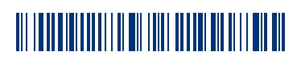
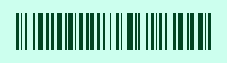
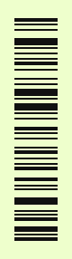
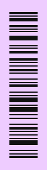
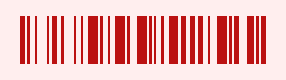

## Barcode svg generator [](/LICENSE)
128 Barcode generator written on pure javascript. Produces highly optimized SVG nodes.

[Barcode svg generator](https://datalog.github.io/demo/barcode-svg/) (Live demo)

## Easy to start
After `barcode.min.js` is downloaded and connected to your html5 page, call:
```javascript
var
svgNode = BARCode('Hello World!');
```

## Playground


```javascript
BARCode({

     msg  : '128 Code'
    ,dim  : [ 286, 80 ]
    ,pad  : [  20, 16 ] /* sample 1: normal orientation */ 

});

BARCode({

     msg  : '128 Code'
    ,dim  : [ 286, 80 ]
    ,pad  : [ 266, 16 ] /* sample 2: vertical flip */ 

});
```



```javascript
BARCode({

     msg  : 'vertical'
    ,dim  : [ 80, 286 ]
    ,pad  : [ 16,  20 ] /* sample 3: vertical orientation */ 

});

BARCode({

     msg  : 'vertical'
    ,dim  : [ 80, 286 ]
    ,pad  : [ 16, 266 ] /* sample 4: horizontal flip */ 

});
```


All available options:
```javascript
BARCode({

     msg  :  message
    ,dim  : [ width, height ]
    ,pad  : [ padding-x, padding-y ]
    ,pal  : [ color, background-color ]

});
```

If something is lost or wrong it will fall back to default values and warn you in console, the picture will turn red:



## Options
* **msg** - barcode `message` string, obviously, this is **mandatory parameter**

* **dim** - is array of [ `width`, `height` ] in pixels, default value is: [ `320`, `80` ]. Set [ `0`, `80` ] and `width` will depend on the length of the horizontal generated barcode. Set [ `80`, `0` ] and `height` will depend on the length of the vertical generated barcode.
* **pad** - is array of [ `padding-x`, `padding-y` ] in pixels, default values is [ `20`, `16` ]. Set [ `0`, `0` ] to discard padding. If (any) padding value is greater than relative dimension value then barcode will be rotated by 180 degrees respectively.
* **pal** - is array of [ `color`, `background-color` ] strings that represent hex color codes, default value is [ `'#000'` ] along with transparent background. Set [`'#000'`,`'#fff'`] to make background opaque.
